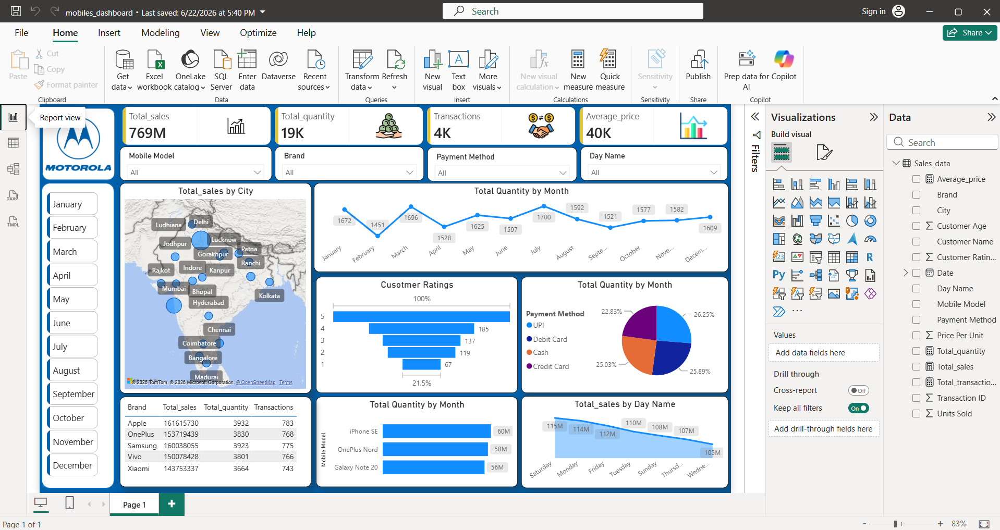

# 📱 Mobile Sales Analysis Dashboard

## 📖 Overview

The **Mobile Sales Analysis Dashboard** is an interactive Business Intelligence project developed using **Microsoft Power BI**. It is designed to transform raw mobile sales data into meaningful insights through dynamic visualizations, KPIs, and interactive reports.

This dashboard helps analyze sales performance across different cities, brands, mobile models, and time periods, enabling data-driven business decisions.

---

## 📊 Dashboard Preview

> *(Add your dashboard screenshot below)*



---

## ✨ Key Features

- Interactive Power BI dashboard
- Sales performance analysis
- Dynamic filters and slicers
- City-wise sales visualization
- Brand and mobile model analysis
- Monthly sales trend analysis
- Customer rating insights
- Payment method distribution
- KPI cards for quick business overview

---

## 📈 Key Performance Indicators (KPIs)

- Total Sales
- Total Quantity Sold
- Total Transactions
- Average Selling Price

---

## 🛠️ Tools & Technologies

- Microsoft Power BI
- Power Query
- DAX (Data Analysis Expressions)
- Microsoft Excel / CSV Dataset
- Data Visualization

---

## 📂 Project Structure

```
Mobile-Sales-Analysis-Dashboard/
│
├── Mobile_Sales_Dashboard.pbix
├── Mobile_Sales_Data.xlsx
├── Dashboard_Screenshot.png
├── icons/
└── README.md
```

---

## 🎯 Business Insights

This dashboard enables users to:

- Monitor overall sales performance
- Compare sales across different cities
- Identify top-performing mobile brands
- Analyze monthly sales trends
- Understand customer preferences
- Evaluate payment methods
- Support business decision-making using interactive reports

---

## 🚀 How to Use

1. Download or clone this repository.
2. Open `Mobile_Sales_Dashboard.pbix` in Microsoft Power BI Desktop.
3. Refresh the dataset if required.
4. Explore the dashboard using the available filters and slicers.

---

## 📌 Dataset

The project uses a mobile sales dataset containing information such as:

- Mobile Brand
- Mobile Model
- Sales Amount
- Quantity
- Customer Ratings
- Payment Method
- City
- Transaction Date

---

## 👨‍💻 Author

**Muhammad Atif Khan**

📧 Email: *Add your email here*

🔗 LinkedIn: *Add your LinkedIn profile*

💻 GitHub: https://github.com/Muhammad-AtifKhan

---

## ⭐ Support

If you found this project helpful, consider giving it a ⭐ on GitHub.
